# CSC4005 Assignment 3
119010115 Yongjin, Huang

# Execution
## Build
```sh
cd /path/to/project
# 1. On Virtual Machine(without CUDA)
./debug.sh
# 2. On Slurm(with CUDA)
./release.sh
```
## Run
```sh
cd build
mpirun -n 4 ./mpi_imgui
mpirun -n 4 ./mpi <size> <rounds>
./pthread_imgui
./pthread <size> <rounds> <thread_num>
./openmp_imgui
./openmp <size> <rounds> <thread_num>
mpirun -n 4 ./hybrid_imgui
mpirun -n 4 ./hybrid <size> <rounds> <thread_num>
./cuda_imgui
./cuda <size> <rounds> <thread_num>
```
# Introduction
An N-body simulation approximates the motion of particles, often specifically particles that interact with one another through some types of physical forces. Using this broad definition, the types of particles that can be simulated using n-body methods are quite significant, ranging from celestial bodies to individual atoms in a gas cloud. From here out, we will specialize the conversation to gravitational interactions, where individual particles are defined as a physical celestial body, such as a planet, star, or black hole. A motion of the particles on the bodies themselves is neglected since it is often not interesting to the problem and will hence add an unnecessarily large number of particles to the simulation. N-body simulation has numerous applications in areas such as astrophysics, molecular dynamics, and plasma physics. The simulation proceeds over time steps, each time computing the net force on each body and thereby updating its position and other attributes. If all pairwise forces are computed directly, this requires $O(N^2)$ operations at each time step.

In this assignment, the N-body simulation is in two dimensions. In order to visualize the N-body simulation, each body is modeled as a ball.
# Design
In each time step, the simulation is divided into two parts for each body:
1. Part One: Calculate the forces between it and the others, and check whether two bodies collide. Two bodies collide if their distance is less than the radius of the ball.
2. Part Two: Update its position, velocity based on the time elapse and check whether it crosses the boundary.

If there are $N$ bodies, the time complexity of the simulation in each time step is $O(N^2)$

The design of sequential version and parallel version differs a little.  
- In the sequential version, in Part One, if two bodies collide, their position and velocity are immediately updated. Thus, Part One computation is halved, and only $\frac{N(N-1)}{2}$ calculation is needed.
- In parallel versions, in Part One, if two bodies collide, the changes in their position and velocity are saved. Thus, their position and velocity are not updated in Part One but in Part Two. The reason for this design is to eliminate the data dependency between bodies.

This slight difference results in different movements of the bodies in visualization.

# Implementations
There are 6 different implementations:
- Sequential
- MPI
- Pthread
- OpenMP
- CUDA
- Hybrid MPI and OpenMP
## Sequential Implementation
This sequential implementation is given by teaching assistants.  

```cpp
void update_for_tick(double elapse,
                    double gravity,
                    double position_range,
                    double radius)
{
    ax.assign(size(), 0);
    ay.assign(size(), 0);
    // Part One
    for (size_t i = 0; i < size(); ++i)
    {
        for (size_t j = i + 1; j < size(); ++j)
        {
            // update both bodies' positions and velocities immediately
            check_and_update(get_body(i), get_body(j), radius, gravity);
        }
    }
    // Part Two
    for (size_t i = 0; i < size(); ++i)
    {
        get_body(i).update_for_tick(elapse, position_range, radius);
    }
}
```

## MPI Implementation
|  |
| :---------------------------------: |
|    Figure 1: MPI Implementation     |

The MPI implementation contains the following steps:
1. The root process creates a body pool and broadcast it to every other process.
2. Each process calculates its range of bodies. Bodies are distributed evenly across processes.
3. Each process runs Part One and Part Two.
4. Gather bodies data to the root process.

```cpp
void worker(int rank, int world_size)
{
    // Preparation: Broadcast all bodies to all processes
    // ...
    // Each process calculate its range of bodies
    pool.clear_acceleration();
    int elements_per_process = pool.size() / world_size;
    size_t st_idx = elements_per_process * rank;
    size_t end_idx = st_idx + elements_per_process;
    if (rank == world_size - 1)
        end_idx = pool.size();
    // Part One
    for (size_t i = st_idx; i < end_idx; i++)
    {
        for (size_t j = 0; j < pool.size(); j++)
        {
            if (i == j)
                continue;
            // update body i's position and velocity immediately
            pool.mpi_check_and_update(pool.get_body(i), pool.get_body(j), local_radius, local_gravity);
        }
    }
    // Part Two
    for (size_t i = st_idx; i < end_idx; i++)
    {
        pool.get_body(i).update_for_tick(local_elapse, local_space, local_radius);
    }
    // Gather bodies data to the root process
    // ...
}
```


## Pthread Implementation
|  |
| :-------------------------------------: |
|    Figure 2: Pthread Implementation     |

The Pthread implementation contains the following steps:
1. The main thread distributes bodies range evenly and create child threads.
2. Each child thread gets its bodies range.
3. Each child thread runs Part One, and wait until all child threads complete Part One using a barrier. Then run Part Two.
```cpp
void schedule(size_t thread_num)
{
    std::vector<pthread_t> threads(thread_num);
    pthread_barrier_init(&barrier, NULL, thread_num);
    pool.clear_acceleration();
    pool.init_delta_vector();
    size_t idx_per_thread = pool.size() / thread_num;
    size_t remainder = pool.size() % thread_num;
    size_t st_idx = 0;
    std::vector<idx_struct> idx_struct_arr;
    for (size_t i = 0; i < threads.size(); i++)
    {
        size_t end_idx = i < remainder ? st_idx + idx_per_thread + 1 : st_idx + idx_per_thread;
        idx_struct_arr.push_back({st_idx, end_idx});
        st_idx = end_idx;
    }
    for (size_t i = 0; i < threads.size(); i++)
    {
        pthread_create(&threads[i], nullptr, worker, reinterpret_cast<void *>(&idx_struct_arr[i]));
    }
    for (auto &thread : threads)
    {
        pthread_join(thread, nullptr);
    }
}

void *worker(void *data)
{
    struct idx_struct *p = reinterpret_cast<idx_struct *>(data);
    // Part One
    for (size_t i = p->st_idx; i < p->end_idx; i++)
    {
        for (size_t j = 0; j < pool.size(); ++j)
        {
            if (i == j)
                continue;
            // save the changes in body i's position and velocity
            pool.shared_memory_check_and_update(pool.get_body(i), pool.get_body(j), radius, gravity);
        }
    }
    pthread_barrier_wait(&barrier);
    // Part Two
    for (size_t i = p->st_idx; i < p->end_idx; i++)
    {
        // update body i's position and velocity using the saved changes in Part One
        pool.get_body(i).update_by_delta_vector();
        pool.get_body(i).update_for_tick(elapse, space, radius);
    }
    return nullptr;
}
```
## OpenMP Implementation
|  |
| :------------------------------------: |
|    Figure 3: OpenMP Implementation     |

Similar to Pthread implementation, the OpenMP implementation contains the following steps:
1. Split Part One among working threads, and each working thread gets one or more bodies.
2. Each working thread runs Part One. After all working threads have finished Part One, they start to run Part Two.
```cpp
void schedule()
{
    pool.clear_acceleration();
    pool.init_delta_vector();
    // Part One
#pragma omp parallel for shared(pool)
    for (size_t i = 0; i < pool.size(); ++i)
    {
        for (size_t j = 0; j < pool.size(); ++j)
        {
            if (i == j)
                continue;
            // save the changes in body i's position and velocity
            pool.shared_memory_check_and_update(pool.get_body(i), pool.get_body(j), radius, gravity);
        }
    }
    // Part Two
#pragma omp parallel for shared(pool)
    for (size_t i = 0; i < pool.size(); ++i)
    {
        // update body i's position and velocity using the saved changes in Part One
        pool.get_body(i).update_by_delta_vector();
        pool.get_body(i).update_for_tick(elapse, space, radius);
    }
}
```
## CUDA Implementation
|  |
| :----------------------------------: |
|    Figure 4: CUDA Implementation     |


Similar to Pthread implementation, the OpenMP implementation contains the following steps:
1. Create a block with many threads using CUDA.
1. Each thread gets its bodies range.
2. Each thread runs Part One, and wait until all child threads complete Part One. Then run Part Two.

```cpp
__device__ __managed__ BodyPool *pool;
// worker() is called in this way:
int main()
{
    dim3 grid(1);
    dim3 block(thread_num);
    worker<<<grid, block>>>();
}

__global__ void worker()
{
    int thread_id = threadIdx.x;
    int elements_per_thread = pool->size / thread_num;
    int st_idx = elements_per_thread * thread_id;
    int end_idx = st_idx + elements_per_thread;
    if (thread_id == thread_num - 1)
        end_idx = pool->size;
    // Part One
    for (int i = st_idx; i < end_idx; i++)
    {
        for (int j = 0; j < pool->size; ++j)
        {
            if (i == j)
                continue;
            // save the changes in body i's position and velocity
            pool->shared_memory_check_and_update(pool->get_body(i), pool->get_body(j), radius, gravity);
        }
    }
    __syncthreads();
    // Part Two
    for (int i = st_idx; i < end_idx; i++)
    {
        // update body i's position and velocity using the saved changes in Part One
        pool->get_body(i).update_by_delta_var();
        pool->get_body(i).update_for_tick(elapse, space, radius);
    }
}
```

Here, I use Unified Memory to simplify the memory copy calls. According to the CUDA documentation, the underlying system manages data access and locality within a CUDA program without the need for explicit memory copy calls. This benefits GPU programming in two primary ways:
- GPU programming is simplified by unifying memory spaces coherently across all GPUs and CPUs in the system and by providing tighter and more straightforward language integration for CUDA programmers.
- Data access speed is maximized by transparently migrating data towards the processor using it.

I overload the operators `new` and `delete` to provide better encapsulation.
```cpp
class Managed
{
public:
    __host__ void *operator new(size_t len)
    {
        void *ptr;
        cudaMallocManaged(&ptr, len);
        cudaDeviceSynchronize();
        return ptr;
    }

    __host__ void operator delete(void *ptr)
    {
        cudaDeviceSynchronize();
        cudaFree(ptr);
    }
};

class BodyPool : public Managed{}
int main()
{
    pool = new BodyPool(static_cast<size_t>(bodies), space, max_mass);
    // call kernel
    delete pool;
}
```
## Hybrid Implementation
|          |
| :--------------------------------------------: |
| Figure 5: Hybrid MPI and OpenMP Implementation |

Hybrid implementation is just adding some OpenMP pragma to the MPI implementation to parallel to Part One and Part Two calculations.

In fact, this kind of hybrid implementation is called Hybrid MPI+OpenMP Master-Only Style. This is easy to implement without topology problems. However, it is not that efficient since all other threads are sleeping while the master thread communicates.
|                       |
| :------------------------------------------: |
| Figure 6: Hybrid MPI and OpenMP Architecture |

The advantages of Master-Only style are:
- It is relatively simple to write and maintain, since there is clear separation
between outer (MPI) and inner (OpenMP) levels of parallelism. It is the natural
style that arises if an incremental, loop-wise approach is taken to adding
OpenMP to an existing MPI code, by identifying the most time consuming loops
and using parallel do/for constructs to parallel them.
- There are no concerns about synchronizing threads before/after sending
messages, since there is an implicit barrier at the end of each parallel region,
and no thread may start the next parallel region until the master thread
encounters the parallel construct (i.e. after any MPI calls).

The disadvantages are:
- Threads other than the master are necessarily idle during MPI calls, and cannot
do any useful computation. 
- Data locality is poor, since all communicated data passes through the cache
where the master thread is executing, as it is packed and unpacked into/from
MPI internal buffers.
- For pure MPI codes running on shared memory clusters, some messages may
be exchanged within the same node (most MPI implementations will do this
using shared memory buffers, instead of using the network). In a
communication phase where many messages are being exchanged it is
therefore natural for the inter-node messages to overlap in time with intra-node
ones. However, in Master-Only style MPI messages cannot overlap in time with
inter-thread communication, since the latter occurs on-demand via the cache
coherency mechanism, and can therefore only occur during OpenMP parallel
regions.
- The only way to synchronize threads before and after message transfers is by
closing and opening parallel regions, which has a relatively high overhead. To
give some idea of the relative costs, the overhead of an OpenMP parallel region
and the cost of sending a $1Kib$ message between nodes are roughly
comparable: both are typically of the order of a few microseconds

```cpp
void worker(int rank, int world_size)
{
    // Preparation: Broadcast all bodies to all processes
    // ...
    // Part One
#pragma omp parallel for shared(pool)
    for (size_t i = st_idx; i < end_idx; i++)
    {
        for (size_t j = 0; j < pool.size(); j++)
        {
            if (i == j)
                continue;
            pool.shared_memory_check_and_update(pool.get_body(i), pool.get_body(j), local_radius, local_gravity);
        }
    }
#pragma omp barrier
#pragma omp parallel for shared(pool)
    // Step 2
    for (size_t i = st_idx; i < end_idx; i++)
    {
        pool.get_body(i).update_by_delta_vector();
        pool.get_body(i).update_for_tick(local_elapse, local_space, local_radius);
    }
    // Gather bodies data to the root process
    // ...

}
```
# Results
Four different problem sizes ranging from $200$, $1000$, $5000$, and $10000$ are tested. 

The performance of the program is analyzed from the following three dimensions:
- Duration in nanoseconds(ns) per time step
- Speedup $Speedup_n = \frac{T_1}{T_n}$ where $T_1$ is the execution time on one process and $T_n$ is the execution time on $n$ processes.

## MPI

|  |
| :---------------------------------: |
|   Figure 1: MPI Duration Overview   |

In Figure 1, the large gap between the blue curve and the other curves shows that the sequential version is much slower than the MPI version. As problem size increases, the gap becomes even larger.


|  |
| :---------------------------------: |
|   Figure 2: MPI Speedup Overview    |

In Figure 2, for those process numbers greater than $1$, as problem size increases, the speedup also increases. The larger the process number, the faster the growth (bigger slope). 

|      |  |
| :-------------------------------------------: | :-----------------------------------------------: |
| Figure 3: MPI Speedup with Problem Size $200$ |  Figure 4: MPI Duration with Problem Size $200$   |


In Figure 3 and Figure 4, as problem size increases, the speedup decreases, and the duration increases. The possible reason is that the computation time of each process is short, and the inter-process communication time becomes the determining factor. Since the duration is so small(less than $6e6ns$), the startup time and the inter-process communication time are relatively large compared to the computation time.

|      |
| :--------------------------------------------: |
| Figure 5: MPI Speedup with Problem Size $1000$ |

In Figure 5, initially, the speedup first increases with the process number. When the process number reaches about $10$, the speedup starts to fluctuate up and down in a slow downward trend. I think the reason is the same as above.

|      |      |
| :--------------------------------------------: | :---------------------------------------------: |
| Figure 6: MPI Speedup with Problem Size $5000$ | Figure 7: MPI Speedup with Problem Size $10000$ |


In Figure 6 and Figure 7, the speedup keeps increasing with the process number. Compared to Figure 6, Figure 7 has a more significant speedup under the same process number. That's because the computation work is more extensive.
## Pthread
For Pthread, the thread number increases from $1$ to $54$, each time by $1$. Pthread requires shared memory and on a single node, and there are only $32$ physical threads on a node.
| 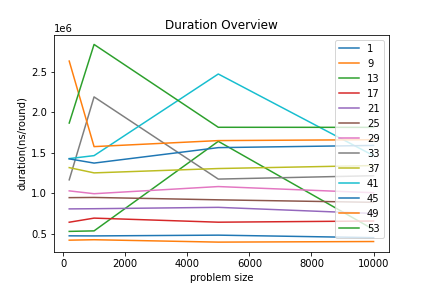 |  |
| :--------------------------------------: | :-------------------------------------: |
|   Figure 1: Pthread Duration Overview    |   Figure 2: Pthread Speedup Overview    |

Figure 1 and Figure 2 show that more threads do not bring better performance. Most thread numbers run slower than the sequential version($1$ thread).

| 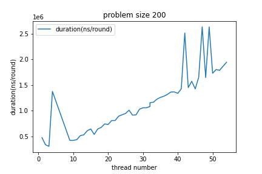 |   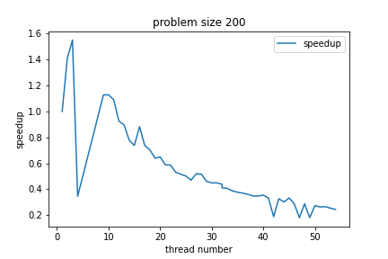   |
| :---------------------------------------------------: | :-----------------------------------------------: |
|  Figure 3: Pthread Duration with Problem Size $200$   | Figure 4: Pthread Speedup with Problem Size $200$ |

|  |   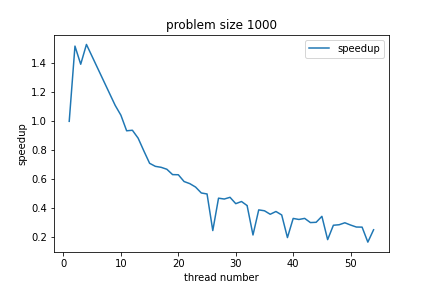   |
| :----------------------------------------------------: | :------------------------------------------------: |
|  Figure 5: Pthread Duration with Problem Size $1000$   | Figure 6: Pthread Speedup with Problem Size $1000$ |

| 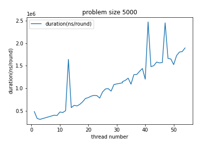 |   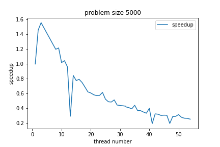   |
| :----------------------------------------------------: | :------------------------------------------------: |
|  Figure 7: Pthread Duration with Problem Size $5000$   | Figure 8: Pthread Speedup with Problem Size $5000$ |

| 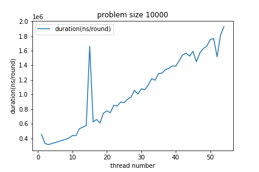 |   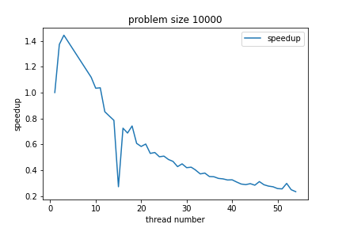   |
| :-----------------------------------------------------: | :--------------------------------------------------: |
|  Figure 9: Pthread Duration with Problem Size $10000$   | Figure 10: Pthread Speedup with Problem Size $10000$ |

From the above 8 figures, it can be found that:
- As the thread number increases, the duration increases, and the speedup decreases, which means that more threads even slow down the computation process.
- The speedup is small and even less than one, and the maximum speedup is only about $1.5$.
- The duration is much smaller than the MPI implementation. It is less than $2e6ns$. 

Thus, a possible reason why its speedup is little is that the computation time is short, and the thread scheduling time becomes the determining factor.   
When the thread number is bigger than $32$, the duration continues to increase with the thread number. Since there are only $32$ physical threads under the current testing environment, adding more threads after reaching the physical thread limit is costly and nonsense. Thread lifecycle overhead. Thread creation and teardown are not free. The actual overhead varies across platforms, but thread creation takes time, introducing latency into request processing.

## OpenMP
For OpenMP, the thread number increases from $1$ to $54$, each time by $1$. OpenMP requires shared memory and on a single node, and there are only $32$ physical threads on a node.

|  | 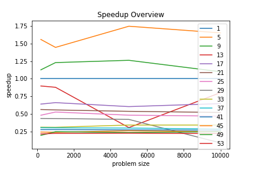 |
| :-------------------------------------: | :------------------------------------: |
|   Figure 1: OpenMP Duration Overview    |   Figure 2: OpenMP Speedup Overview    |

Figure 1 and Figure 2 show that more threads do not bring better performance. Most thread numbers run slower than the sequential version($1$ thread).

|  |      |
| :--------------------------------------------------: | :----------------------------------------------: |
|  Figure 3: OpenMP Duration with Problem Size $200$   | Figure 4: OpenMP Speedup with Problem Size $200$ |

| 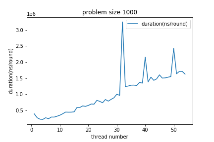 |      |
| :---------------------------------------------------: | :-----------------------------------------------: |
|  Figure 5: OpenMP Duration with Problem Size $1000$   | Figure 6: OpenMP Speedup with Problem Size $1000$ |

| 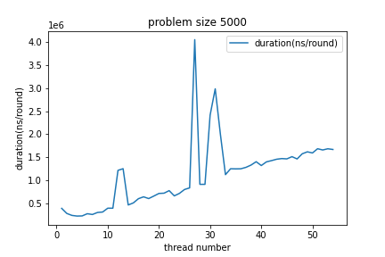 |      |
| :---------------------------------------------------: | :-----------------------------------------------: |
|  Figure 7: OpenMP Duration with Problem Size $5000$   | Figure 8: OpenMP Speedup with Problem Size $5000$ |

| 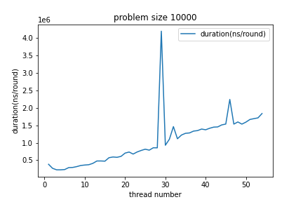 |      |
| :----------------------------------------------------: | :-------------------------------------------------: |
|  Figure 9: OpenMP Duration with Problem Size $10000$   | Figure 10: OpenMP Speedup with Problem Size $10000$ |

The above 8 figures show similar results with the Pthread implementation as the following:
- As the thread number increases, the duration increases, and the speedup decreases, which means more threads even slow down the computation process.
- The speedup is small and even less than one, and the maximum speedup is only about $1.75$.
- The duration is much smaller than the MPI implementation. The majority of data is less than $2e6ns$.
The reason for this result is the same as the Pthread implementation. Because the overall duration is small and thread scheduling is the determining factor.
## CUDA
For CUDA, it tests on GTX2080Ti with maximum $1024$ threads per block.
|  |
| :-----------------------------------: |
|   Figure 1: CUDA Duration Overview    |

In Figure 1, the large gap between the blue curve and the other curves shows that the sequential version is much slower than the CUDA version. As problem size increases, the gap becomes even larger.

|  |
| :----------------------------------: |
|   Figure 2: CUDA Speedup Overview    |

In Figure 2, it can be noticed that the speedup of some thread numbers first increases with problem size then decreases. When the thread number is $256$, the speedup always increases with the problem size.

It is interesting to point out that when the thread number is $1024$, which is the maximum thread number per block for this NVIDIA GPU, the speedup does not perform well. The possible reason is that CUDA uses a unique architecture called SIMT (Single-Instruction, Multiple-Thread). 
- According to the CUDA documentation, The multiprocessor creates, manages, schedules, and executes threads in groups of 32 parallel threads called warps. Individual threads composing a warp start together at the same program address, but they have their own instruction address counter and register state and are therefore free to branch and execute independently. The term warp originates from weaving, the first parallel thread technology. A half-warp is either the first or second half of a warp. A quarter-warp is either the first, second, third, or fourth quarter of a warp.
- I think this can explain the result that when the problem size is large, thread numbers $256$, $128$, $64$, and $32$ perform better than other thread numbers.


|  |      |
| :------------------------------------------------: | :--------------------------------------------: |
|  Figure 3: CUDA Duration with Problem Size $200$   | Figure 4: CUDA Speedup with Problem Size $200$ |


|  |      |
| :-------------------------------------------------: | :---------------------------------------------: |
|  Figure 5: CUDA Duration with Problem Size $1000$   | Figure 6: CUDA Speedup with Problem Size $1000$ |

|  |      |
| :-------------------------------------------------: | :---------------------------------------------: |
|  Figure 7: CUDA Duration with Problem Size $5000$   | Figure 8: CUDA Speedup with Problem Size $5000$ |

|  |      |
| :--------------------------------------------------: | :-----------------------------------------------: |
|  Figure 9: CUDA Duration with Problem Size $10000$   | Figure 10: CUDA Speedup with Problem Size $10000$ |

In the above figures, as problem size increases, the speedup first increases, then decreases. The possible reason is that the computation time of each thread is short, and the thread creation time becomes the determining factor. This can be proved by the fact that when the thread number is fixed, as the problem size increases, the speedup gets larger.

## Hybrid
For Hybrid, the MPI process number is fixed as $4$, and the OpenMP thread number increases from $1$ to $32$, each time by $1$. The physical resources is $2$ nodes with total $64$ threads.

|  | 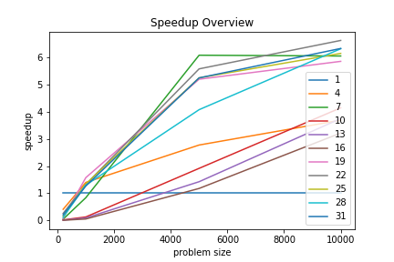 |
| :-------------------------------------: | :------------------------------------: |
|   Figure 1: Hybrid Duration Overview    |   Figure 2: Hybrid Speedup Overview    |

Figure 1 and Figure 2 show that more threads bring more speedup and less duration.

|  |      |
| :--------------------------------------------------: | :----------------------------------------------: |
|  Figure 3: Hybrid Duration with Problem Size $200$   | Figure 4: Hybrid Speedup with Problem Size $200$ |

|  |      |
| :---------------------------------------------------: | :-----------------------------------------------: |
|  Figure 5: Hybrid Duration with Problem Size $1000$   | Figure 6: Hybrid Speedup with Problem Size $1000$ |

The above 4 figures show that when the problem size is $200$ and $1000$, the duration first up then down, and the speedup is little. The little speedup can be explained by the small computation workload and the relatively large thread scheduling workload.
|  |      |
| :---------------------------------------------------: | :-----------------------------------------------: |
|  Figure 7: Hybrid Duration with Problem Size $5000$   | Figure 8: Hybrid Speedup with Problem Size $5000$ |

|  |      |
| :----------------------------------------------------: | :-------------------------------------------------: |
|  Figure 9: Hybrid Duration with Problem Size $10000$   | Figure 10: Hybrid Speedup with Problem Size $10000$ |

The above 4 figures show that when the problem size is large, the duration first down and up and finally down, and the speedup is larger than that when the problem size is small. 

It is interesting to see that for all problem sizes, there is a peak in duration VS. problem size figure, and this peak occurs when the thread number is about $16$. Since the total number of physical threads is $64$ with $4$ MPI processes, the physical resources are used up when the OpenMP thread number is greater than $16$. Thus, this finding can be interpreted as the following:
1. Before fully utilizing the physical resources, more OpenMP threads bring worse performance.
2. After fully utilizing the physical resources, more OpenMP threads bring better performance.

## Comparisons
It's easy to compare the speedup of different implementations. MPI and CUDA have close maximum speedup(up to $60$) and they are much higher than others. Pthread and OpenMp share similar speedup pattern and their speedup are both small(less than $2$). While Hybrid lies between these two groups.

|  |  |
| :---------------------------------: | :----------------------------------: |
|   Figure 1: MPI Speedup Overview    |   Figure 2: CUDA Speedup Overview    |

|  |  |
| :-------------------------------------: | :------------------------------------: |
|   Figure 3: Pthread Speedup Overview    |   Figure 4: OpenMP Speedup Overview    |

|  |
| :------------------------------------: |
|   Figure 5: Hybrid Speedup Overview    |

When it comes to the duration, 

# Conclusion
After working out this assignment, I have learned to write OpenMP, CUDA, and hybrid MPI and OpenMP programs. Different implementations of parallel programming bring different programming experiences. It enables me to think deeply about the pros and cons of each implementation. OpenMP is definitely the easiest one to write. Pthread and CUDA are two shared memory models using CPU and GPU, respectively. MPI presents the highest performance.
# References
- https://openmp.org/wp-content/uploads/HybridPP_Slides.pdf
- https://docs.nvidia.com/cuda/cuda-c-programming-guide/
- https://docs.nvidia.com/cuda/cuda-c-programming-guide/index.html#simt-architecture
- http://www.intertwine-project.eu/sites/default/files/images/INTERTWinE_Best_Practice_Guide_MPI%2BOpenMP_1.1.pdf
